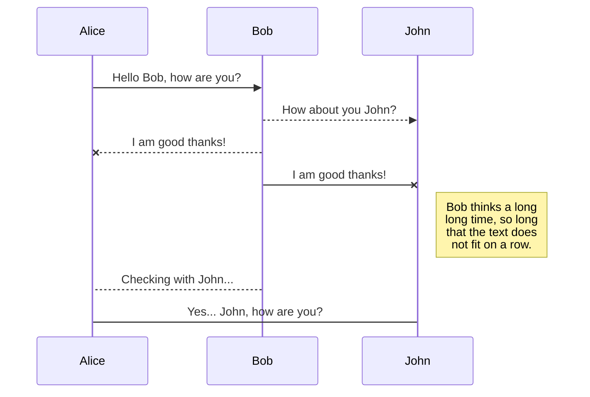

# Example repository for a C development environment
## cloned for use in presentation

This is the example repository for a [post on the Interrupt blog](https://interrupt.memfault.com/blog/a-modern-c-dev-env). It is a demo development environment using **Docker**, _CMake_, Unity, and GitHub Actions.
>this project is very good, so say I

testing extended features

